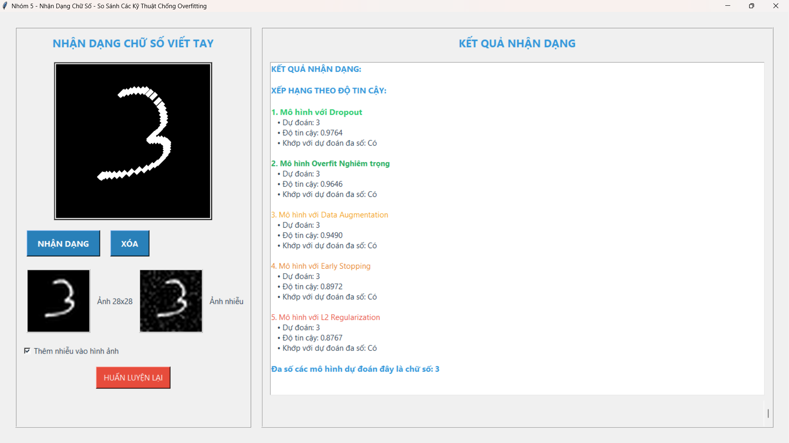

# HandWritten-Identify: Nhận Dạng Chữ Số Viết Tay

## Giới thiệu

- **Môn học:** Deep Learning
- **Sinh viên:** Ngành Công Nghệ Thông Tin
- **Trường:** Đại học Công Thương (HUIT)

Dự án "HandWritten-Identify" là một ứng dụng nhận dạng chữ số viết tay sử dụng các mô hình deep learning với các kỹ thuật khác nhau để ngăn chặn overfitting. Ứng dụng cho phép người dùng vẽ chữ số và nhận được kết quả dự đoán từ nhiều mô hình khác nhau, giúp so sánh hiệu quả của các phương pháp chống overfitting trong học máy.

## Các tính năng chính

- Giao diện vẽ chữ số viết tay tương tác
- Nhận dạng chữ số sử dụng 5 mô hình CNN khác nhau:
  1. Mô hình Overfit Nghiêm trọng (không có kỹ thuật regularization)
  2. Mô hình với Dropout
  3. Mô hình với L2 Regularization
  4. Mô hình với Early Stopping
  5. Mô hình với Data Augmentation
- So sánh và xếp hạng kết quả dự đoán từ các mô hình
- Tùy chọn thêm nhiễu vào ảnh để kiểm tra độ bền của mô hình
- Hiển thị trực quan ảnh đầu vào sau khi xử lý (28x28) và ảnh có nhiễu (nếu được chọn)
- Khả năng huấn luyện lại các mô hình

## Công nghệ sử dụng

- **Ngôn ngữ:** Python
- **Deep Learning:** TensorFlow, Keras
- **Xử lý ảnh:** OpenCV, PIL (Pillow)
- **Giao diện:** Tkinter
- **Bộ dữ liệu:** MNIST

## Cấu trúc dự án

```
HandWritten/
├── knn.py               # File chính chứa mã nguồn của ứng dụng
├── image.png            # Ảnh tạm thời lưu hình vẽ của người dùng
├── resized_image.png    # Ảnh đã resize về kích thước 28x28
├── noisy_image.png      # Ảnh đã thêm nhiễu (nếu được chọn)
├── README.md            # Tài liệu mô tả dự án
├── Images/              # Thư mục chứa ảnh mẫu (nếu cần)
└── Các file mô hình (*.h5):
    ├── mnist_model_overfit_severe.h5
    ├── mnist_model_dropout.h5
    ├── mnist_model_l2_reg.h5
    ├── mnist_model_early_stopping.h5
    └── mnist_model_data_augment.h5
```

## Cách cài đặt

1. Clone repository:

```bash
git clone https://github.com/your-username/HandWritten-Identify.git
cd HandWritten-Identify
```

2. Cài đặt các thư viện cần thiết:

```bash
pip install tensorflow pillow opencv-python numpy
```

## Cách sử dụng

1. Chạy ứng dụng:

```bash
python knn.py
```

2. Vẽ một chữ số từ 0-9 vào vùng canvas màu đen.
3. Nhấn nút "NHẬN DẠNG" để xem kết quả dự đoán.
4. Bật tùy chọn "Thêm nhiễu vào hình ảnh" nếu muốn kiểm tra độ bền của mô hình.
5. Nhấn nút "XÓA" để xóa vùng vẽ và bắt đầu lại.
6. Nhấn nút "HUẤN LUYỆN LẠI" nếu muốn huấn luyện lại các mô hình khi khởi động lại ứng dụng.

## Chi tiết kỹ thuật

### Các kỹ thuật chống Overfitting được so sánh

1. **Dropout**: Ngẫu nhiên tắt các neuron trong quá trình huấn luyện.
2. **L2 Regularization**: Thêm penalty vào hàm loss để giới hạn các trọng số lớn.
3. **Early Stopping**: Dừng huấn luyện khi hiệu suất trên tập validation không cải thiện.
4. **Data Augmentation**: Tạo thêm dữ liệu huấn luyện bằng cách biến đổi dữ liệu hiện có.

### Mô hình CNN

Các mô hình sử dụng kiến trúc CNN với:

- Các lớp Convolutional với kích thước filter 3x3
- Các lớp MaxPooling với pool size 2x2
- Các lớp Fully Connected
- Lớp đầu ra 10 neuron với activation softmax (cho 10 chữ số 0-9)

## Kết quả và đánh giá

Ứng dụng hiển thị:

- Kết quả dự đoán từ mỗi mô hình
- Xếp hạng các mô hình theo độ tin cậy
- So sánh với dự đoán đa số từ các mô hình có regularization
- Hiển thị ảnh đã xử lý để người dùng có thể hiểu quá trình

## Giao diện ứng dụng



_Hình ảnh: Giao diện ứng dụng nhận dạng chữ số viết tay với kết quả nhận dạng chữ số "3" từ các mô hình khác nhau_

Giao diện được thiết kế trực quan với hai phần chính:

- **Bên trái**: Vùng vẽ chữ số và hiển thị ảnh đã xử lý
- **Bên phải**: Kết quả nhận dạng từ 5 mô hình khác nhau, được sắp xếp theo độ tin cậy

Mỗi mô hình đưa ra dự đoán kèm theo độ tin cậy, cho phép người dùng so sánh hiệu quả của các kỹ thuật chống overfitting khác nhau.

## Hướng phát triển

- Thêm các kỹ thuật regularization khác như Batch Normalization
- Hỗ trợ nhận dạng các ký tự khác ngoài chữ số
- Cải thiện giao diện người dùng
- Hỗ trợ nhận dạng nhiều chữ số trong một ảnh

---

© 2024 Trần Công Minh | Đại học Công Thương (HUIT)
